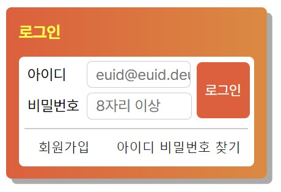

# 과제 2: Position을 활용한 로그인 창

## Login.html
- `div class="container-box` : 로그인 창 배경인 주황박스 생성하기
- form태그 밖의 div 태그 : 로그인 박스 안의 흰 박스 생성 코드
- `div class="login__group` : 아이디, 비밀번호, 로그인 버튼 묶기 위한 코드
- `<div class="line"></div>` : 아이디, 비밀번호 입력창과 회원가입, 아이디-비밀번호 찾기 사이의 경계선 생성하기
- `<ul class="help__group">` : 회원가입 버튼같은 아이디 비밀번호 찾기 버튼 묶기


---
## Login.css
- `@font-face` : 웹 폰트 사용
- `@import url(./a11y.css)` : 로그인 폼 글씨 화면에서 안보이게 하기
- `login__group{position: relative;}` : login__group을 기준으로 로그인 버튼의 위치를 지정하기 위해 position: relative 부여한다.
- `idInput__input{margin-left:12px;}` : 아이디는 세 글자, 비밀번호는 4글자이기 때문에 id와 비밀번호 입력하는 칸의 시작 위치가 다르다. 이를 맞추기 위해 margin-left값을 부여하여 '아이디'글씨와 아이디 입력란 사이에 여백을 준다.

```css
.idInput__input, .pwInput__input{
  padding: 0px 0px 0px 8px;
  height: 24px;
}
```
-> 입력상자의 왼쪽에 padding값을 부여하여 값이 적절한 위치부터 작성되도록 한다.

<br>

`.login-button{
  position: absolute;}` : button에 position: absolute를 부여하여 login__group(아이디, 비밀번호, 로그인버튼 그룹)을 기준으로 위치를 지정한다.


```css
.new, .find{
  text-decoration: none;
  margin-top: 4px;
}
```

-> text-decoration에 none을 지정하여 글자 아래 생기는 밑줄을 없앤다.

-> margin-top 값을 지정하여 위의 div로 생성한 경계선과 4px만큼 거리를 둔다.


<br>

```css
.new{
  float: left;
}` : 
.find{
  padding-left: 20px;
}
```
-> 회원가입 링크를 help__goup의 왼쪽에 배치하고 그 20px 옆에 아이디 비밀번호 찾기 링크를 배치한다.

<br>
<br>
<br>

---

## 과제 결과물



