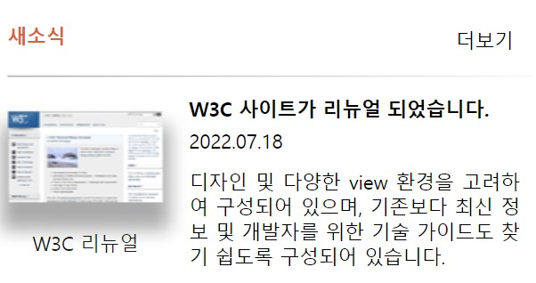

# 과제 4 : Grid를 활용하여 뉴스 제작하기  

## grid.html
- 전체 박스를 container-box로 묶고 그 안에 상위에 박스 하나, 하위에 박스 2개를 생성했다. 하위 박스 중 하나는 이미지와 캡션이 들어가는 박스, 다른 하나는 텍스트 3개를 담은 리스트가 들어가는 박스를 생성하였다.
  </br>
  </br>

- figure 태그 안에 img 태그와 figcaption을 추가하여 박스 안에 이미지와 캡션을 넣을 수 있도록 하였다.
</br>
</br>

- 하위 오른쪽에 있는 박스 안에는 리스트를 추가하여 텍스트 3개를 함께 넣었다.
<br>
<br>


---

## grid.css
```css
.container-box{
  display: grid;
  grid-template: repeat(4, 1fr) / repeat(6, 1fr);
  grid-auto-rows: auto;
  width: 380px;
  height: 200px;
}
```
-> 모든 박스를 묶고 있는 가장 상위 박스에 `display: grid`로grid 레이아웃을 적용하고 `grid-template`을 통해 4행 6열의 그리드를 생성하였다. 
</br>
</br>

```css
  border-bottom: 1px solid;
  border-image:linear-gradient(09deg, #a9a9a9 0%, white 60%);
  border-image-slice: 1;
```
-> 상위 메뉴와 하위 메뉴 사이의 경계선을 생성하는 코드
</br>
</br>
</br>

- 각각의 그리드 아이템에 다른 `grid-area`값을 추가하여 원하는 위치에 박스를 배치하였다.
</br>
</br>
</br>

---

## 과제 결과물
</br>

