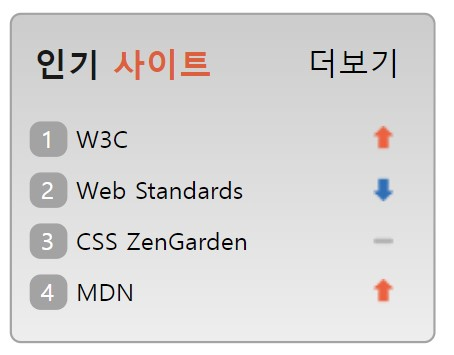

# 과제 5 : Sprite를 활용하여 인기 사이트 메뉴 제작하기 

## sprite.html
- section 태그를 활용하여 전체를 하나로 묶는 박스를 생성하고, 그 안에
h2태그와 ol태그, a태그 총 3개로 나눠서 박스의 타이틀과 내용, 더보기 버튼을 구성하였다.

- 인기 사이트 타이틀에서 사이트에는 orange_title 클래스를 정의하여 따로 주황색을 주었다.
  
- ol태그 속 4개의 리스트에 sprite 클래스와 각각 순서에 맞는 sprite1과 같은 클래스를 정의하여 리스트에 맞는 기호를 넣을 수 있도록 하였다. 

- ol 속 li 태그에 a태그를 추가하여 클릭하면 해당 링크로 갈 수 있도록 하였다.

  </br>
  </br>


---

## sprite.css
```css
.favorite_site{
  position: relative;
  width: 190px;
  height: 147px;
  background: linear-gradient(180deg, #CCCCCC 0%, #EEEEEE 100%);
  border: 1px solid #A3A3A3;
  border-radius: 5px;
}

.site_plus{
  position: absolute;
  top: 12.45px;
  right: 15px;
  font-size: 14px;
  text-decoration: none;
  color: #000000;
}

```
-> 여러 속성값을 주어 회색 박스를 생성하고, 부모요소에 position: relative를, 자식요소에 position: absolute를 지정하여 자식요소인 더보기 텍스트가 부모 위에서 자유롭게 배치될 수 있도록 하였다. 


```css
.favorite_list{
  font-size: 11px;
  list-style: none;
  padding-left: 0;
  counter-reset: number;
}

```
-> 리스트의 순서 번호를 없애고 padding-left 값을 0을 주어 왼쪽으로 붙을 수 있도록 하였다. 그리고  counter-reset을 통해 counter 이름을 number로 지정하였다.


</br>
</br>

```css
.favorite_item::before{
  display: inline-block;
  counter-increment: number;
  padding-left: 5px;
  content: counter(number);
  width: 12px;
  height: 16px;
  background: #A3A3A3;
  border-radius: 5px;
  color: white;
}
```
-> ccounter-increment를 통해 number의 카운터 값을 1씩 증가시키고, content: counter(number)을 통해 number의 카운터 값을 표시하여 화면에 나타날 수 있도록 한다. 그리고 inline-block으로 지정하여 숫자와 텍스트가 잘 배열될 수 있도록 하였다.
</br>
</br>
</br>

```css
.sprite{
  background: url(rank.png) no-repeat;
  height: 15px;
}
.sprite1{
  background-position: 155px 2px;
}

.sprite2{
  background-position: 155px -42px;
}

.sprite3{
  background-position: 155px -19px;
}

.sprite4{
  background-position: 155px 2px;
}
```
-> sprite클래스를 통해 기호가 들어가는 리스트에 배경이미지를 깔아주고, 각각 다른 스프라이트 클래스명에 일치하는 이미지를 표시하기 위해 해당 이미지가 존재하는 값을 주었다.
</br>
</br>
</br>

---

## 과제 결과물
</br>

